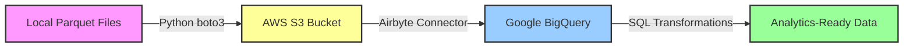

# 📊 Data Pipeline: Parquet → S3 → BigQuery

> **End-to-end data engineering pipeline demonstrating ETL best practices with AWS S3, Airbyte, and Google BigQuery**

[](https://www.python.org/downloads/)
[](https://aws.amazon.com/s3/)
[](https://airbyte.com/)
[](https://cloud.google.com/bigquery)
[](https://opensource.org/licenses/MIT)

---

## 🎯 Project Overview

This project implements a complete data pipeline that:

1. **Extracts** Parquet files from local storage
2. **Loads** them to AWS S3 using Python
3. **Syncs** data from S3 to Google BigQuery via Airbyte
4. **Transforms** data in BigQuery using SQL

**Use Case:** Ideal for data engineers looking to build scalable, cloud-based data pipelines with modern tooling.

---

## 🏗️ Architecture



### Pipeline Flow

| Stage | Tool | Description |
|-------|------|-------------|
| **Extract** | Python | Read Parquet files from localhost |
| **Upload** | boto3 | Transfer files to S3 bucket |
| **Sync** | Airbyte | Replicate data from S3 to BigQuery |
| **Transform** | BigQuery SQL | Clean, aggregate, and model data |

---

## 📋 Table of Contents

- [Prerequisites](#-prerequisites)
- [Installation](#-installation)
- [Configuration](#-configuration)
- [Pipeline Execution](#-pipeline-execution)
  - [Step 1: Upload to S3](#step-1-upload-parquet-files-to-s3)
  - [Step 2: Airbyte Setup](#step-2-configure-airbyte-sync)
  - [Step 3: BigQuery Transformations](#step-3-transform-data-in-bigquery)
- [Project Structure](#-project-structure)
- [Usage Examples](#-usage-examples)
- [Troubleshooting](#-troubleshooting)
- [Contributing](#-contributing)
- [License](#-license)

---

## ✅ Prerequisites

### Required Software

- **Python 3.8+** ([Download](https://www.python.org/downloads/))
- **Docker & Docker Compose** ([Installation Guide](https://docs.docker.com/get-docker/))
- **AWS Account** with S3 access
- **Google Cloud Platform** account with BigQuery enabled
- **Git**

### Required Access

- AWS IAM user with S3 permissions (`s3:PutObject`, `s3:GetObject`, `s3:ListBucket`)
- GCP Service Account with BigQuery roles (`BigQuery Data Editor`, `BigQuery Job User`)

---

## 🚀 Installation

### 1. Clone Repository

```bash
git clone https://github.com/yourusername/data-pipeline-s3-bigquery.git
cd data-pipeline-s3-bigquery
```

### 2. Create Virtual Environment

```bash
python -m venv venv

# Activate virtual environment
# Windows
venv\Scripts\activate

# macOS/Linux
source venv/bin/activate
```

### 3. Install Python Dependencies

```bash
pip install -r requirements.txt
```

**requirements.txt:**
```txt
boto3==1.28.85
pandas==2.1.3
pyarrow==14.0.1
google-cloud-bigquery==3.13.0
python-dotenv==1.0.0
requests==2.31.0
```

### 4. Install Airbyte

```bash
# Clone Airbyte repository
git clone --depth 1 https://github.com/airbytehq/airbyte.git
cd airbyte

# Start Airbyte
docker compose up -d
```

Access Airbyte UI at: **http://localhost:8000**  
Default credentials: `airbyte` / `password`

---

## ⚙️ Configuration

### 1. Environment Variables

Create a `.env` file in the project root:

```bash
# AWS Configuration
AWS_ACCESS_KEY_ID=your_aws_access_key
AWS_SECRET_ACCESS_KEY=your_aws_secret_key
AWS_REGION=us-east-1
S3_BUCKET_NAME=your-data-bucket

# Google Cloud Configuration
GOOGLE_APPLICATION_CREDENTIALS=./credentials/gcp-service-account.json
GCP_PROJECT_ID=your-gcp-project-id
BQ_DATASET_ID=analytics_dataset
BQ_LOCATION=US

# Airbyte (Optional - for API access)
AIRBYTE_API_URL=http://localhost:8000/api/v1
```

### 2. GCP Service Account Setup

```bash
# Create service account
gcloud iam service-accounts create airbyte-bigquery \
    --display-name="Airbyte BigQuery Service Account"

# Grant BigQuery permissions
gcloud projects add-iam-policy-binding YOUR_PROJECT_ID \
    --member="serviceAccount:airbyte-bigquery@YOUR_PROJECT_ID.iam.gserviceaccount.com" \
    --role="roles/bigquery.dataEditor"

gcloud projects add-iam-policy-binding YOUR_PROJECT_ID \
    --member="serviceAccount:airbyte-bigquery@YOUR_PROJECT_ID.iam.gserviceaccount.com" \
    --role="roles/bigquery.jobUser"

# Create and download key
gcloud iam service-accounts keys create ./credentials/gcp-service-account.json \
    --iam-account=airbyte-bigquery@YOUR_PROJECT_ID.iam.gserviceaccount.com
```

### 3. AWS S3 Bucket Setup

```bash
# Create S3 bucket
aws s3 mb s3://your-data-bucket --region us-east-1

# Enable versioning (optional)
aws s3api put-bucket-versioning \
    --bucket your-data-bucket \
    --versioning-configuration Status=Enabled
```

---

## 🔄 Pipeline Execution

### Step 1: Upload Parquet Files to S3

**Script: `scripts/upload_to_s3.py`**

```python
import boto3
import os
from pathlib import Path
from dotenv import load_dotenv
import logging

# Configure logging
logging.basicConfig(level=logging.INFO)
logger = logging.getLogger(__name__)

load_dotenv()

class S3Uploader:
    def __init__(self):
        self.s3_client = boto3.client(
            's3',
            aws_access_key_id=os.getenv('AWS_ACCESS_KEY_ID'),
            aws_secret_access_key=os.getenv('AWS_SECRET_ACCESS_KEY'),
            region_name=os.getenv('AWS_REGION')
        )
        self.bucket_name = os.getenv('S3_BUCKET_NAME')
    
    def upload_file(self, local_path, s3_key=None):
        """Upload a single Parquet file to S3"""
        if s3_key is None:
            s3_key = f"raw/{Path(local_path).name}"
        
        try:
            logger.info(f"Uploading {local_path} to s3://{self.bucket_name}/{s3_key}")
            
            self.s3_client.upload_file(
                local_path,
                self.bucket_name,
                s3_key,
                ExtraArgs={
                    'ContentType': 'application/octet-stream',
                    'Metadata': {
                        'uploaded_by': 'data-pipeline',
                        'source': 'localhost'
                    }
                }
            )
            
            logger.info(f"✓ Successfully uploaded to S3")
            return True
            
        except Exception as e:
            logger.error(f"✗ Upload failed: {e}")
            return False
    
    def upload_directory(self, local_dir, s3_prefix='raw/'):
        """Upload all Parquet files from a directory"""
        parquet_files = list(Path(local_dir).glob('*.parquet'))
        
        logger.info(f"Found {len(parquet_files)} Parquet files")
        
        success_count = 0
        for file_path in parquet_files:
            s3_key = f"{s3_prefix}{file_path.name}"
            if self.upload_file(str(file_path), s3_key):
                success_count += 1
        
        logger.info(f"Uploaded {success_count}/{len(parquet_files)} files")
        return success_count

if __name__ == "__main__":
    uploader = S3Uploader()
    
    # Upload single file
    uploader.upload_file('data/sales_data.parquet', 'raw/sales_data.parquet')
    
    # Or upload entire directory
    # uploader.upload_directory('data/', 'raw/')
```

**Run the upload:**

```bash
python scripts/upload_to_s3.py
```

**Verify upload:**

```bash
aws s3 ls s3://your-data-bucket/raw/ --human-readable
```

---

### Step 2: Configure Airbyte Sync

#### 2.1 Setup S3 Source

1. Navigate to **http://localhost:8000**
2. Click **Sources** → **+ New source**
3. Search and select **S3**
4. Configure the source:

```yaml
Source Name: S3 Raw Data
AWS Access Key ID: [Your AWS Key]
AWS Secret Access Key: [Your Secret Key]
Bucket Name: your-data-bucket
Path Prefix: raw/
File Format: Parquet
```

5. Click **Set up source** and test the connection

#### 2.2 Setup BigQuery Destination

1. Click **Destinations** → **+ New destination**
2. Search and select **BigQuery**
3. Configure the destination:

```yaml
Destination Name: BigQuery Warehouse
Project ID: your-gcp-project-id
Dataset Location: US
Default Dataset ID: analytics_dataset
Loading Method: Standard Inserts
Service Account Key JSON: [Paste your service account JSON]
```

4. Click **Set up destination** and test the connection

#### 2.3 Create Connection

1. Click **Connections** → **+ New connection**
2. Select **S3 Raw Data** as source
3. Select **BigQuery Warehouse** as destination
4. Configure sync settings:

```yaml
Replication Frequency: Every 24 hours (or Manual)
Destination Namespace: Custom format
Namespace Format: analytics_dataset
Stream Prefix: s3_

Sync Mode: Full Refresh | Overwrite
Normalization: Basic Normalization
```

5. Click **Set up connection**

#### 2.4 Trigger Sync

**Manual sync via UI:**
- Go to your connection and click **Sync now**

**Programmatic sync via Python:**

```python
import requests
import os

def trigger_airbyte_sync(connection_id):
    """Trigger Airbyte sync via API"""
    url = f"{os.getenv('AIRBYTE_API_URL')}/connections/sync"
    
    response = requests.post(
        url,
        json={"connectionId": connection_id},
        headers={"Content-Type": "application/json"}
    )
    
    if response.status_code == 200:
        print("✓ Sync triggered successfully")
        return response.json()
    else:
        print(f"✗ Sync failed: {response.text}")
        return None

# Usage
trigger_airbyte_sync("your-connection-id")
```

---

### Step 3: Transform Data in BigQuery

#### Create Transformation Script

**File: `sql/transformations.sql`**

```sql
-- ============================================
-- Data Cleaning and Deduplication
-- ============================================

CREATE OR REPLACE TABLE `{project_id}.{dataset}.cleaned_data` AS
WITH raw_data AS (
  SELECT 
    *,
    ROW_NUMBER() OVER (
      PARTITION BY id 
      ORDER BY _airbyte_emitted_at DESC
    ) AS row_num
  FROM `{project_id}.{dataset}.s3_sales_data`
),

deduplicated AS (
  SELECT * EXCEPT(row_num)
  FROM raw_data
  WHERE row_num = 1
    AND id IS NOT NULL
    AND amount IS NOT NULL
    AND amount > 0
)

SELECT
  id,
  customer_id,
  product_id,
  CAST(amount AS FLOAT64) AS amount,
  CAST(quantity AS INT64) AS quantity,
  PARSE_TIMESTAMP('%Y-%m-%d %H:%M:%S', transaction_date) AS transaction_timestamp,
  DATE(PARSE_TIMESTAMP('%Y-%m-%d %H:%M:%S', transaction_date)) AS transaction_date,
  status,
  region,
  CURRENT_TIMESTAMP() AS processed_at
FROM deduplicated;

-- ============================================
-- Aggregation: Daily Sales Summary
-- ============================================

CREATE OR REPLACE TABLE `{project_id}.{dataset}.daily_sales_summary` AS
SELECT
  transaction_date,
  region,
  COUNT(DISTINCT id) AS total_transactions,
  COUNT(DISTINCT customer_id) AS unique_customers,
  SUM(amount) AS total_revenue,
  AVG(amount) AS avg_transaction_value,
  SUM(quantity) AS total_items_sold
FROM `{project_id}.{dataset}.cleaned_data`
GROUP BY transaction_date, region
ORDER BY transaction_date DESC, region;

-- ============================================
-- Customer Analytics
-- ============================================

CREATE OR REPLACE TABLE `{project_id}.{dataset}.customer_metrics` AS
SELECT
  customer_id,
  COUNT(DISTINCT id) AS total_purchases,
  SUM(amount) AS lifetime_value,
  AVG(amount) AS avg_purchase_value,
  MIN(transaction_date) AS first_purchase_date,
  MAX(transaction_date) AS last_purchase_date,
  DATE_DIFF(MAX(transaction_date), MIN(transaction_date), DAY) AS customer_lifetime_days
FROM `{project_id}.{dataset}.cleaned_data`
GROUP BY customer_id
HAVING total_purchases > 0;

-- ============================================
-- Create Analytics Views
-- ============================================

CREATE OR REPLACE VIEW `{project_id}.{dataset}.v_top_customers` AS
SELECT
  customer_id,
  lifetime_value,
  total_purchases,
  avg_purchase_value,
  RANK() OVER (ORDER BY lifetime_value DESC) AS value_rank
FROM `{project_id}.{dataset}.customer_metrics`
ORDER BY lifetime_value DESC
LIMIT 100;

CREATE OR REPLACE VIEW `{project_id}.{dataset}.v_regional_performance` AS
SELECT
  region,
  SUM(total_revenue) AS total_regional_revenue,
  AVG(total_revenue) AS avg_daily_revenue,
  SUM(total_transactions) AS total_transactions,
  AVG(avg_transaction_value) AS avg_transaction_value
FROM `{project_id}.{dataset}.daily_sales_summary`
GROUP BY region
ORDER BY total_regional_revenue DESC;
```

#### Execute Transformations Using Python

**File: `scripts/run_transformations.py`**

```python
from google.cloud import bigquery
import os
from dotenv import load_dotenv
import logging

logging.basicConfig(level=logging.INFO)
logger = logging.getLogger(__name__)

load_dotenv()

class BigQueryTransformer:
    def __init__(self):
        self.client = bigquery.Client(
            project=os.getenv('GCP_PROJECT_ID')
        )
        self.project_id = os.getenv('GCP_PROJECT_ID')
        self.dataset = os.getenv('BQ_DATASET_ID')
    
    def run_sql_file(self, sql_file_path):
        """Execute SQL transformations from file"""
        logger.info(f"Reading SQL from {sql_file_path}")
        
        with open(sql_file_path, 'r') as f:
            sql_content = f.read()
        
        # Replace placeholders
        sql_content = sql_content.replace('{project_id}', self.project_id)
        sql_content = sql_content.replace('{dataset}', self.dataset)
        
        # Split and execute queries
        queries = [q.strip() for q in sql_content.split(';') if q.strip()]
        
        for i, query in enumerate(queries, 1):
            try:
                logger.info(f"Executing query {i}/{len(queries)}")
                query_job = self.client.query(query)
                query_job.result()  # Wait for completion
                logger.info(f"✓ Query {i} completed successfully")
            except Exception as e:
                logger.error(f"✗ Query {i} failed: {e}")
                raise
    
    def get_table_stats(self, table_name):
        """Get row count and size of a table"""
        query = f"""
        SELECT 
            COUNT(*) as row_count,
            ROUND(SUM(size_bytes)/(1024*1024), 2) as size_mb
        FROM `{self.project_id}.{self.dataset}.__TABLES__`
        WHERE table_id = '{table_name}'
        """
        
        results = self.client.query(query).result()
        for row in results:
            return {'rows': row.row_count, 'size_mb': row.size_mb}
        return None

if __name__ == "__main__":
    transformer = BigQueryTransformer()
    
    # Run transformations
    logger.info("Starting BigQuery transformations...")
    transformer.run_sql_file('sql/transformations.sql')
    
    # Display statistics
    logger.info("\n=== Table Statistics ===")
    for table in ['cleaned_data', 'daily_sales_summary', 'customer_metrics']:
        stats = transformer.get_table_stats(table)
        if stats:
            logger.info(f"{table}: {stats['rows']:,} rows, {stats['size_mb']} MB")
    
    logger.info("✓ All transformations completed!")
```

**Run transformations:**

```bash
python scripts/run_transformations.py
```

**Verify in BigQuery:**

```bash
# Check table row counts
bq query --use_legacy_sql=false \
  'SELECT table_id, row_count 
   FROM `your-project-id.analytics_dataset.__TABLES__`'
```

---

## 📁 Project Structure

```
data-pipeline-s3-bigquery/
│
├── data/                           # Local Parquet files
│   ├── sales_data.parquet
│   ├── customers.parquet
│   └── products.parquet
│
├── scripts/
│   ├── upload_to_s3.py            # Upload files to S3
│   ├── airbyte_sync.py            # Trigger Airbyte syncs
│   └── run_transformations.py     # Execute BigQuery SQL
│
├── sql/
│   ├── transformations.sql        # Main transformation logic
│   ├── views.sql                  # Analytics views
│   └── tests.sql                  # Data quality tests
│
├── credentials/
│   └── gcp-service-account.json   # GCP credentials (gitignored)
│
├── notebooks/
│   └── data_analysis.ipynb        # Jupyter notebook for analysis
│
├── tests/
│   ├── test_upload.py             # Unit tests for S3 upload
│   └── test_transformations.py    # Tests for BigQuery logic
│
├── .env                           # Environment variables (gitignored)
├── .env.example                   # Template for .env
├── .gitignore
├── requirements.txt               # Python dependencies
├── README.md                      # This file
├── LICENSE
└── pipeline.sh                    # Automated pipeline script
```

---

## 💻 Usage Examples

### Automated Pipeline Execution

**Create `pipeline.sh`:**

```bash
#!/bin/bash

set -e  # Exit on error

echo "================================================"
echo "   Data Pipeline Execution"
echo "================================================"

# Colors for output
GREEN='\033[0;32m'
BLUE='\033[0;34m'
NC='\033[0m' # No Color

# Step 1: Upload to S3
echo -e "\n${BLUE}[1/3] Uploading data to S3...${NC}"
python scripts/upload_to_s3.py
echo -e "${GREEN}✓ Upload complete${NC}"

# Step 2: Trigger Airbyte sync
echo -e "\n${BLUE}[2/3] Syncing S3 to BigQuery via Airbyte...${NC}"
python scripts/airbyte_sync.py
echo -e "${GREEN}✓ Sync complete${NC}"

# Step 3: Run transformations
echo -e "\n${BLUE}[3/3] Running BigQuery transformations...${NC}"
python scripts/run_transformations.py
echo -e "${GREEN}✓ Transformations complete${NC}"

echo -e "\n${GREEN}================================================"
echo "   Pipeline completed successfully!"
echo -e "================================================${NC}"
```

**Make executable and run:**

```bash
chmod +x pipeline.sh
./pipeline.sh
```

### Scheduled Execution with Cron

```bash
# Edit crontab
crontab -e

# Add daily execution at 2 AM
0 2 * * * cd /path/to/project && ./pipeline.sh >> logs/pipeline.log 2>&1
```

---

## 🐛 Troubleshooting

### Issue: S3 Upload Permission Denied

**Solution:**

```bash
# Verify AWS credentials
aws sts get-caller-identity

# Check S3 bucket policy
aws s3api get-bucket-policy --bucket your-data-bucket

# Test S3 write access
echo "test" > test.txt
aws s3 cp test.txt s3://your-data-bucket/test.txt
rm test.txt
```

### Issue: Airbyte Connection Failed

**Check S3 Source:**
```bash
# Verify files exist in S3
aws s3 ls s3://your-data-bucket/raw/ --recursive

# Check IAM permissions
aws iam get-user-policy --user-name your-iam-user --policy-name your-policy
```

**Check BigQuery Destination:**
```bash
# Test service account permissions
bq ls --project_id=your-project-id

# Verify dataset exists
bq ls your-project-id:
```

### Issue: BigQuery Transformation Errors

**Common fixes:**

```python
# Check if dataset exists
from google.cloud import bigquery
client = bigquery.Client()

datasets = list(client.list_datasets())
print([d.dataset_id for d in datasets])

# Create dataset if missing
dataset_id = "analytics_dataset"
dataset = bigquery.Dataset(f"{client.project}.{dataset_id}")
dataset.location = "US"
dataset = client.create_dataset(dataset, exists_ok=True)
```

### Enable Debug Logging

```python
import logging

logging.basicConfig(
    level=logging.DEBUG,
    format='%(asctime)s - %(name)s - %(levelname)s - %(message)s',
    handlers=[
        logging.FileHandler('debug.log'),
        logging.StreamHandler()
    ]
)
```

---

## 📊 Monitoring & Validation

### Data Quality Checks

**File: `sql/tests.sql`**

```sql
-- Check for duplicates
SELECT 
  id, 
  COUNT(*) as duplicate_count
FROM `{project_id}.{dataset}.cleaned_data`
GROUP BY id
HAVING COUNT(*) > 1;

-- Check for null critical fields
SELECT
  COUNTIF(id IS NULL) as null_ids,
  COUNTIF(customer_id IS NULL) as null_customers,
  COUNTIF(amount IS NULL) as null_amounts
FROM `{project_id}.{dataset}.cleaned_data`;

-- Validate date ranges
SELECT
  MIN(transaction_date) as earliest_date,
  MAX(transaction_date) as latest_date,
  COUNT(*) as total_records
FROM `{project_id}.{dataset}.cleaned_data`;
```

### Pipeline Metrics

```bash
# S3 file count and size
aws s3 ls s3://your-data-bucket/raw/ --recursive --summarize

# BigQuery table statistics
bq show --format=prettyjson your-project-id:analytics_dataset.cleaned_data

# Airbyte sync status (via API)
curl http://localhost:8000/api/v1/connections/get \
  -H "Content-Type: application/json" \
  -d '{"connectionId": "your-connection-id"}'
```

---

## 🤝 Contributing

Contributions are welcome! Please follow these steps:

1. **Fork** the repository
2. **Create** a feature branch: `git checkout -b feature/amazing-feature`
3. **Commit** your changes: `git commit -m 'Add amazing feature'`
4. **Push** to the branch: `git push origin feature/amazing-feature`
5. **Open** a Pull Request

### Coding Standards

- Follow PEP 8 for Python code
- Add docstrings to all functions
- Include unit tests for new features
- Update documentation as needed

---

## 📚 Additional Resources

- [AWS S3 Documentation](https://docs.aws.amazon.com/s3/)
- [Airbyte Documentation](https://docs.airbyte.com/)
- [BigQuery Documentation](https://cloud.google.com/bigquery/docs)
- [boto3 Documentation](https://boto3.amazonaws.com/v1/documentation/api/latest/index.html)

---

## 📄 License

This project is licensed under the MIT License - see the [LICENSE](LICENSE) file for details.

---

## 👤 Author

**Your Name**
- GitHub: [@yourusername](https://github.com/yourusername)
- LinkedIn: [Your LinkedIn](https://linkedin.com/in/yourprofile)
- Email: your.email@example.com

---

## 🌟 Acknowledgments

- Thanks to the Airbyte team for their excellent open-source data integration platform
- AWS and Google Cloud for robust cloud infrastructure
- The Python data community for amazing libraries

---

<div align="center">

**⭐ If you find this project useful, please give it a star! ⭐**

[Report Bug](https://github.com/yourusername/data-pipeline-s3-bigquery/issues) · 
[Request Feature](https://github.com/yourusername/data-pipeline-s3-bigquery/issues) · 
[Documentation](https://github.com/yourusername/data-pipeline-s3-bigquery/wiki)

Made with ❤️ by data engineers, for data engineers

</div> 